# Global Superstore — Customer & Revenue Analysis
### ShadowFox Data Analyst Internship — Intermediate Level
**Prepared by:** [Your Name]
**Dataset:** Global Superstore | 51,290 order lines | 2011–2014 | 147 countries | 1,590 customers

---

## Executive summary

Global Superstore looks like a healthy business: revenue grew **26.3%** in 2014 to **$4.30M**, and
profit margin has held steady near **11.6%** for four years.

That picture is misleading in two ways.

First, **the growth is not broad-based**. New customer acquisition collapsed from 1,309 customers in
2011 to **15 in 2014**. By 2014, **99.7%** of revenue came from customers acquired in earlier years.
The company is not expanding — it is monetising a fixed base harder.

Second, **the margin is being actively destroyed by discounting**. Orders discounted above 20%
represent 22% of all order lines and lose **$814,682** — more than half of total company profit of
$1.47M. Above 40% discount, 98.4% of order lines lose money.

Both problems are fixable, and the second is fixable immediately through pricing policy alone.

---

## 1. Business question

> The business is growing over 26% a year. Is that growth healthy, and where is profit leaking?

This framing drove the analysis: rather than describing the dataset, each section tests a
hypothesis about the quality of growth and the location of profit loss.

---

## 2. Data preparation

| Step | Detail |
|---|---|
| Source | `Global_Superstore2.csv` — 51,290 rows × 24 columns |
| Encoding | `latin1` (non-UTF-8 characters in product names) |
| Numeric parsing | `thousands=','` applied; every numeric column validated for silent coercion |
| Dates | `order_date`, `ship_date` parsed with `dayfirst=True` |
| Derived fields | `year`, `month`, `month_year`, `delivery_days`, `profit_margin` |
| Duplicates / nulls | None found in analysis columns |
| Customer key | **`customer_id`**, not `customer_name` |

### 2.1 Why `customer_id` and not `customer_name`

The dataset contains 795 unique customer *names* but 1,590 unique customer *IDs*. A single name
averages ~20 distinct countries. Names are recycled across regions, so grouping by name silently
merges unrelated people and roughly halves the apparent customer count.

All customer-level analysis in this report keys on `customer_id`.

### 2.2 A data-quality failure worth documenting

While preparing the beginner-level version of this project, I used the common idiom:

```python
df['sales'] = pd.to_numeric(df['sales'], errors='coerce')
```

The source export formatted large values with thousand separators (`"2,309.65"`). `to_numeric`
cannot parse those, and `errors='coerce'` converted them to `NaN` **without raising an error**.

The tell was that the largest surviving value was exactly **999.00**.

| | Mis-parsed | Correct |
|---|---|---|
| Total revenue | $7,835,128 | **$12,642,502** |
| Reported margin | 18.75% | **11.61%** |
| Rows affected | 2,630 (5.1%) | — |
| Revenue hidden | **38.0%** | — |

The loss was not random — it removed the largest orders, which carried roughly half of all profit.
The inflated margin arose from dividing profit from *all* orders by revenue from *only small* orders.

**Practice changed:** every numeric column is now validated after parsing, and a suspiciously round
maximum (999, 9999) is treated as a red flag rather than a data characteristic.

---

## 3. Exploratory overview

| Metric | Value |
|---|---|
| Total revenue | $12,642,502 |
| Total profit | $1,467,457 |
| Profit margin | 11.6% |
| Orders | 25,035 |
| Customers | 1,590 |
| Average order value | $505 |
| Loss-making order lines | 24.5% |

| Year | Revenue | Growth | Margin | Revenue/customer |
|---|---|---|---|---|
| 2011 | $2.26M | — | 11.0% | $1,726 |
| 2012 | $2.68M | +18.5% | 11.5% | $1,950 |
| 2013 | $3.41M | +27.2% | 11.9% | $2,336 |
| 2014 | $4.30M | +26.3% | 11.7% | $2,846 |

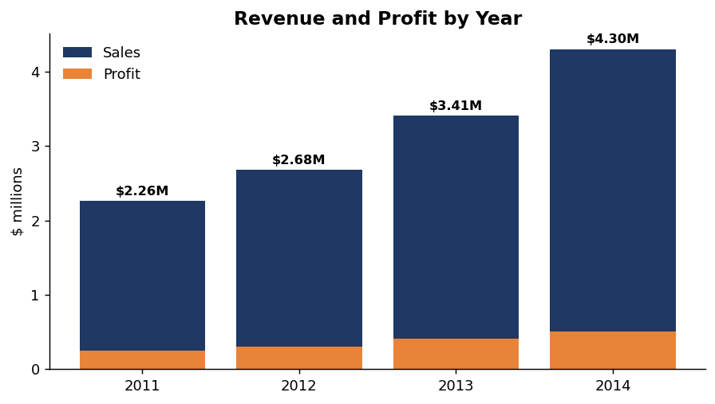

Revenue accelerates and margin is stable. Sections 4–5 test whether this is as good as it looks.

---

## 4. Customer analysis

### 4.1 Revenue concentration

| Customer decile | Share of revenue |
|---|---|
| Top 5% (79) | 15.0% |
| Top 10% (159) | 26.9% |
| Top 20% (318) | **46.7%** |
| Top 50% (795) | 87.3% |

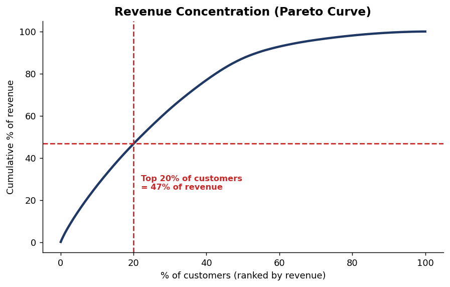

Concentration is meaningful but not dangerous — no single-account dependency risk.

### 4.2 RFM segmentation

Customers scored on Recency, Frequency and Monetary value (quartiles, 4 = best), snapshot
date 2015-01-01.

| Segment | Customers | % of customers | Revenue | % of revenue | Avg recency (days) | Avg orders |
|---|---|---|---|---|---|---|
| Champions | 552 | 34.7% | $7.93M | **62.7%** | 15 | 26.7 |
| At Risk (High Value) | 218 | 13.7% | $2.93M | **23.1%** | **62** | 25.2 |
| Hibernating | 257 | 16.2% | $0.71M | 5.6% | 137 | 8.4 |
| Loyal | 165 | 10.4% | $0.48M | 3.8% | 18 | 9.7 |
| Lost / Low Value | 316 | 19.9% | $0.45M | 3.6% | 235 | 4.2 |
| New / Promising | 82 | 5.2% | $0.15M | 1.1% | 17 | 4.7 |

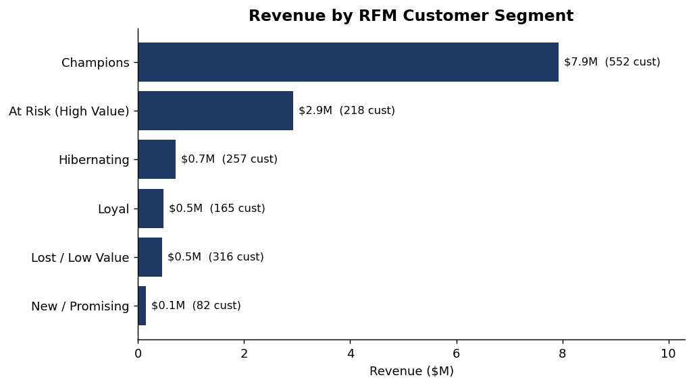

**The actionable finding is the At-Risk segment.** These 218 customers order almost as frequently as
Champions (25.2 vs 26.7) and spend almost as much ($13.4k vs $14.4k each), but their average
recency is **62 days versus 15**. They are worth **$2.93M** and are drifting.

They are the highest-ROI retention target in the dataset because they have already proven they spend.

### 4.3 Cohort retention

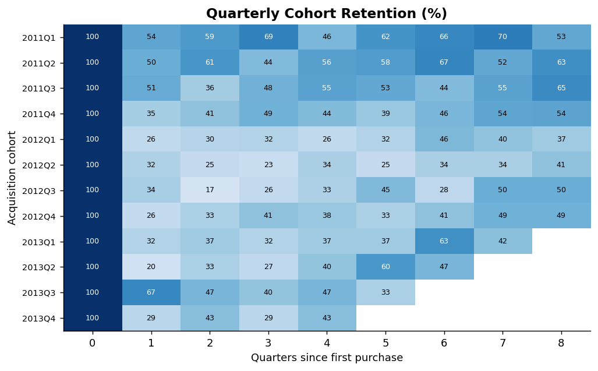

Quarterly retention settles at **40–50%** and does not decay toward zero. Early cohorts (2011)
retain notably better than later ones, but no cohort collapses.

**Retention is a strength.** The problem lies elsewhere.

---

## 5. Where growth actually comes from

If retention is solid and revenue is growing 26%, the growth must come from somewhere specific.

| Year | New customers acquired | Revenue from new customers |
|---|---|---|
| 2011 | 1,309 | 100% |
| 2012 | 210 | 4.8% |
| 2013 | 56 | 1.0% |
| 2014 | **15** | **0.3%** |

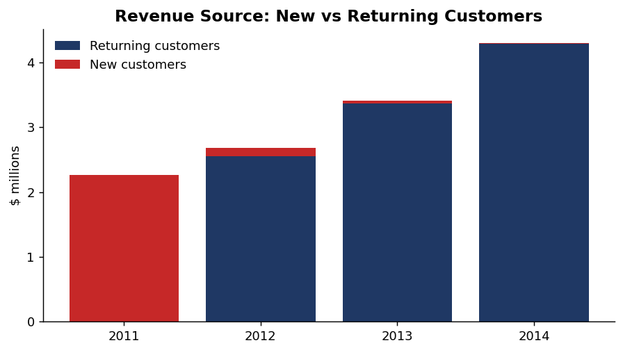
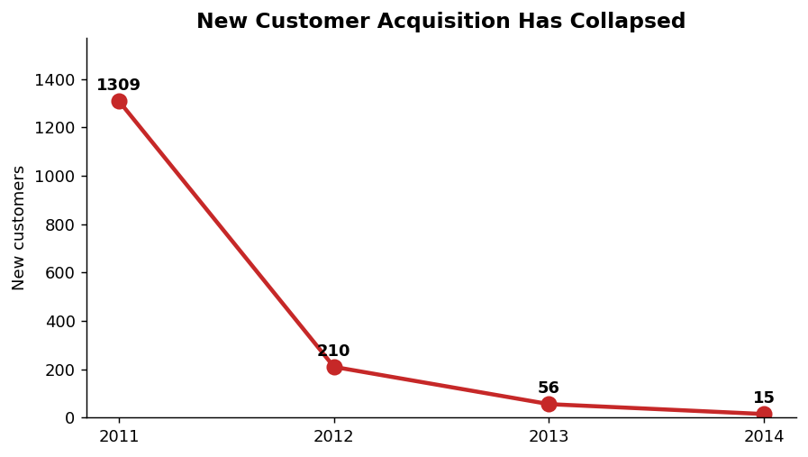

### 5.1 Visualising the imbalance

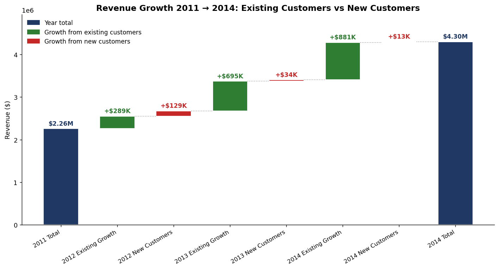

Every green bar (growth from existing customers) dwarfs the red bar beside it (growth from new
customers), and the red bars shrink toward almost nothing by 2014 — from $129K in 2012 to just $13K
in 2014, against $881K of existing-customer growth that same year. This is the clearest single
visual confirmation that the business is mining an existing base rather than expanding it.

**Acquisition has effectively stopped.** All growth comes from existing customers buying more
often (3.4 → 5.6 orders/year) and spending more ($1,726 → $2,846 each).

**Why this matters:** growth built purely on deepening existing relationships has a ceiling — it is
capped by how much 1,590 customers can absorb. With no replacement pipeline, every churned customer
is a permanent loss, and the strong 26% headline masks a structural fragility.

*Caveat:* this dataset contains a closed customer pool, so the severity is partly a dataset
characteristic. The analytical conclusion is unchanged: **the growth story rests entirely on a base
that is not being replenished.**

---

## 6. Profitability and discounting

| Discount band | Order lines | % of lines | Revenue | Margin | % loss-making |
|---|---|---|---|---|---|
| 0% | 29,009 | 56.6% | $6.99M | **+25.3%** | 0.0% |
| 1–10% | 4,679 | 9.1% | $1.96M | +17.2% | 19.3% |
| 11–20% | 6,274 | 12.2% | $1.76M | +9.9% | 23.3% |
| 21–30% | 967 | 1.9% | $0.38M | **−5.5%** | 62.2% |
| 31–40% | 3,400 | 6.6% | $0.70M | −23.7% | 80.2% |
| >40% | 6,961 | 13.6% | $0.85M | **−74.1%** | **98.4%** |

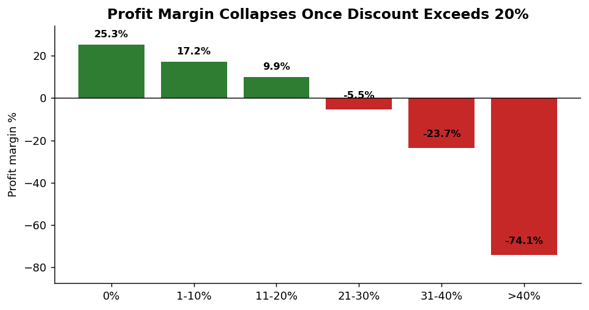

**Margin crosses zero between 20% and 30% discount.** This is the single clearest actionable
threshold in the data.

- Discounts above 20% cover **22% of all order lines**
- They destroy **$814,682** of profit
- Total company profit is $1.47M — so this leak is worth **over half of all profit earned**

### 6.1 Product-level consequence

| Sub-category | Revenue | Margin | Avg discount |
|---|---|---|---|
| **Tables** | $757,042 | **−8.5%** | **30%** |
| Machines | $779,060 | +7.6% | 20% |
| Chairs | $1,501,682 | +9.3% | 17% |
| Paper | $244,292 | +24.2% | 8% |

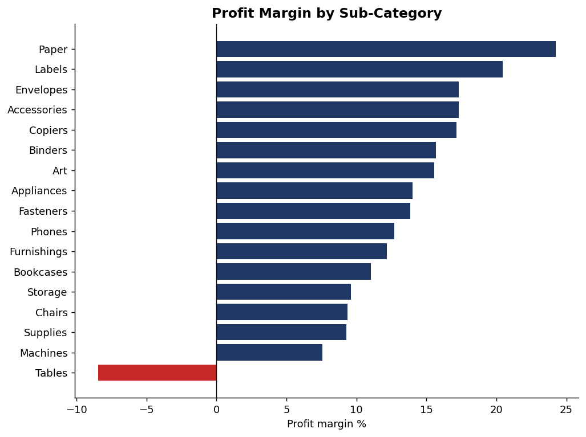

**Tables is the only sub-category losing money overall — and carries the deepest average discount.**
The two facts are almost certainly linked rather than coincidental.

### 6.2 Market-level consequence

| Market | Revenue | Margin | Avg discount |
|---|---|---|---|
| APAC | $3.59M | 12.2% | 13% |
| EU | $2.94M | 12.7% | 10% |
| US | $2.30M | 12.5% | 15% |
| LATAM | $2.16M | 10.2% | 14% |
| **EMEA** | $0.81M | **5.4%** | **20%** |
| Africa | $0.78M | 11.3% | 16% |
| **Canada** | $0.07M | **26.6%** | **0%** |

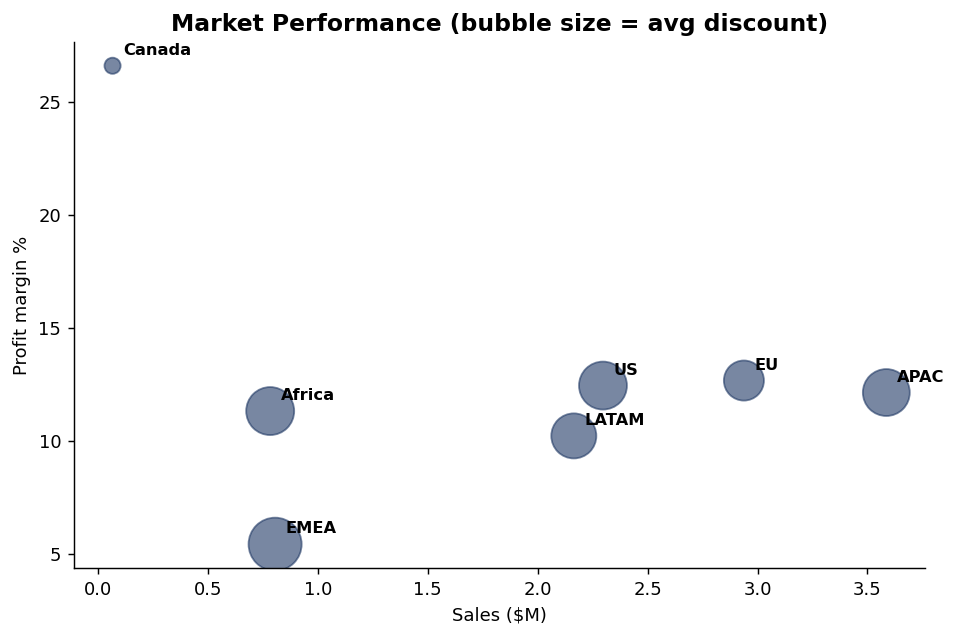

Market margin tracks discounting almost perfectly. Canada sells the same catalogue with **zero
discounting** and earns **5× EMEA's margin**. This is a pricing-discipline difference, not a
market-quality difference.

---

## 7. Seasonality

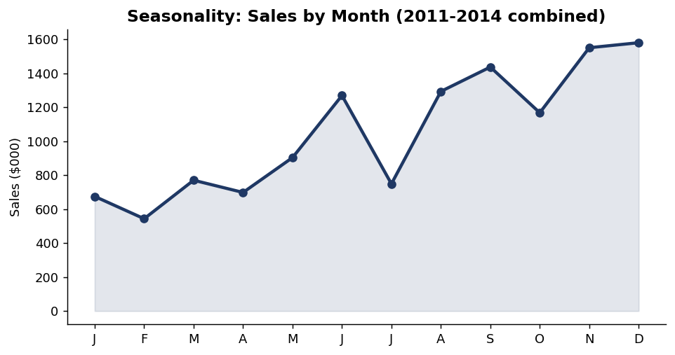

Demand is strongly seasonal: **December (~$1.58M)** is nearly **3× February (~$0.54M)**, with a
sustained second-half peak from August onward.

---

## 8. Recommendations

| # | Recommendation | Evidence | Estimated impact |
|---|---|---|---|
| 1 | **Cap discounts at 20% without approval** | Margin turns negative between 20–30%; 98.4% of >40% lines lose money | Up to **$814,682** profit protected |
| 2 | **Validate with an A/B test before global rollout** | The discount–margin link is correlational, not proven causal (§9) — cap discounts at 20% in one EMEA sub-region first, and monitor volume vs. margin for a full quarter before wider rollout | De-risks Recommendation 1 |
| 3 | **Win-back campaign for 218 At-Risk customers** | Buy as often as Champions but 62-day vs 15-day recency; see CLV vs. CAC note below | **$2.93M** revenue defended |
| 4 | **Rebuild the acquisition pipeline** | 1,309 → 15 new customers/year; 0.3% of 2014 revenue | Removes the ceiling on future growth |
| 5 | **Reprice, renegotiate, or exit Tables** | Only loss-making sub-category (−8.5%), deepest discount (30%) | **+$64,083** |
| 6 | **Apply Canada's pricing discipline to EMEA** | Same catalogue: 0% discount → 26.6% margin vs 20% → 5.4% | Several margin points on $0.81M |
| 7 | **Plan inventory and staffing around seasonality** | Dec ≈ 3× Feb | Working-capital efficiency |

**On Recommendation 3 — CLV vs. CAC:** the win-back budget should be sized against the *Customer
Lifetime Value* of the At-Risk segment, not judged on cost in isolation. This dataset has no
marketing-spend field, so a real Customer Acquisition Cost can't be computed here — but the
directional logic holds regardless of the exact figure: retaining a proven-spending existing customer
is well-established to be cheaper than acquiring a new one, and Finding 2 shows the company is doing
almost none of the latter (15 new customers in 2014). Spending to win back even a fraction of the
$2.9M at-risk cohort is very likely to beat the cost of replacing that revenue through new
acquisition — practically the only other lever available given Finding 2.

**Sequencing:** Recommendation 1 (the policy cap) and Recommendation 2 (the A/B test that validates
it) should run together — the test *is* the rollout mechanism, not a separate later step. Rebuilding
acquisition (4) is the most strategically important item but the slowest to show results, so it
should start in parallel rather than after the others.

---

## 9. Method notes and limitations

- **Customer keying:** `customer_id` used throughout; `customer_name` is not unique.
- **Margin consistency:** margin is always profit ÷ revenue *on the same row set* — the error that
  produced the misleading 18.75% figure.
- **RFM:** quartile scoring, snapshot 2015-01-01. Thresholds are relative, so segments describe
  standing *within this customer base*, not absolute benchmarks.
- **Correlation, not proven causation:** discount level and margin move together strongly, but the
  data cannot rule out that low-margin products are simply discounted more often. The recommended
  discount cap should be validated with a controlled test before full rollout.
- **Closed customer pool:** the dataset does not add customers after 2011 at a realistic rate, which
  amplifies the acquisition finding.
- **Returns data not included** in this version; returned orders may overstate net revenue.

---

## 10. Reproducing this analysis

```
Intermediate_Analysis.ipynb     Full analysis, runs top to bottom
cleaned_superstore_FIXED.csv    Correctly parsed dataset
charts/                         All figures used in this report
```

Requirements: `pandas`, `numpy`, `matplotlib`. Set `RAW_PATH` in the notebook, then Run All.
